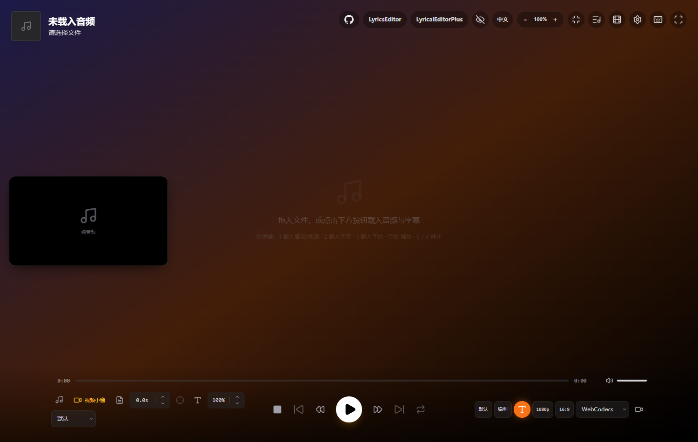
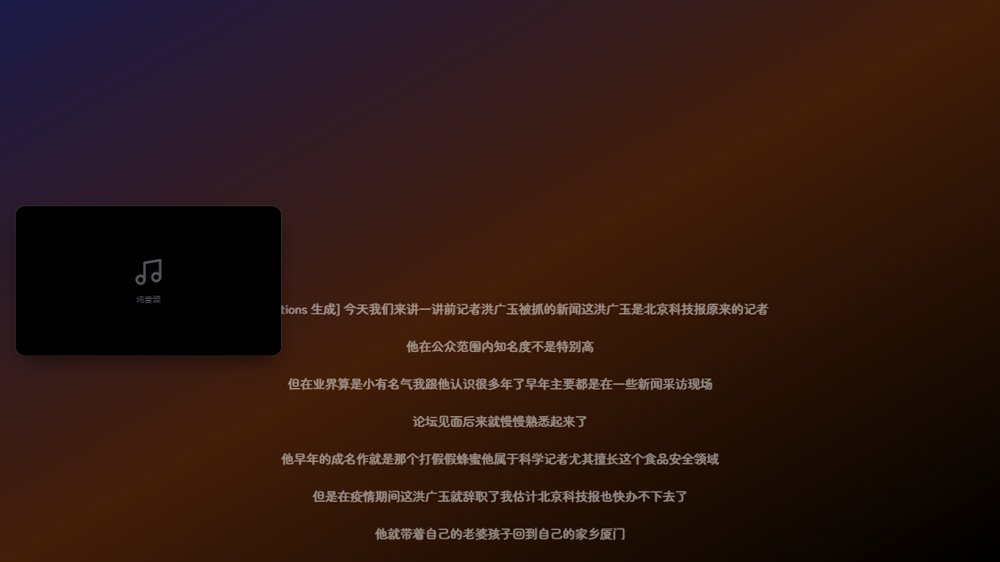

<div align="center">
  
  <h1>dokidoki 字幕播放器</h1>
  <p>字幕是主角，视频是配角。</p>
</div>

为「**音频播客 / 无背景音乐的视频 + 字幕**」这个场景改的本地播放器。字幕占满主画面，视频缩在左侧小窗里，可以随时调出整条字幕文稿跳转。

底子是 [dotslashgabut/immersive-audio-player-lyric-video-maker](https://github.com/dotslashgabut/immersive-audio-player-lyric-video-maker)（v2.3.18），在它上面改造，不是重写。



---

## 怎么用

想先看看长什么样，或者需要发给别人用，直接开在线版：

**<https://dokidoki-6mc.pages.dev/>** —— 托管在 Cloudflare Pages，带宽不限，功能完整（`crossOriginIsolated: true`，FFmpeg 渲染引擎可用）。



上游作者也部署了一份：[Vercel 版](https://immersiveaudioplayer.vercel.app/)（功能完整）、[GitHub Pages 版](https://dotslashgabut.github.io/audioplayer/)。
GitHub Pages 那份不能自定义响应头，拿不到 `SharedArrayBuffer`，FFmpeg 渲染引擎用不了，只适合看界面。

### 离线包（推荐）

到 [Releases](../../releases) 下载 `dokidoki-offline.zip`，解压到任意位置，双击 `启动 dokidoki.cmd`。浏览器会自动打开 `http://localhost:3000/`。用完关掉那个命令行窗口就停了。

不需要装 Node、Python 或任何运行环境，Windows 自带的 PowerShell 就够。

> **不要直接双击 `app/index.html`。** 那是 Vite 打的 ES Module 包，`file://` 下浏览器会拒绝加载模块脚本；而且 FFmpeg WASM 需要 `SharedArrayBuffer`，必须由服务端下发 COOP / COEP 响应头。所以必须走一个本地 HTTP 服务 —— 那个 `.cmd` 就是干这个的，它调用同目录的 `server.ps1`。

### 从源码跑

```bash
npm install --legacy-peer-deps   # 这个参数不能省
npm run dev                      # 开发，http://localhost:5173
npm run build                    # 构建到 dist/
npm run preview                  # 预览构建产物，http://localhost:4173
```

`--legacy-peer-deps` 是必须的：上游 lockfile 把 `vite@8.0.16` 和 `vite-plugin-pwa@1.2.0` 锁在一起，而后者的 peer 只声明到 vite 7，npm 会直接报冲突退出。

### 重新打离线包

```bash
python offline/打包离线版.py
```

跑一次 `npm run build`，把 `dist/` 和三个启动脚本按中文 Windows 的编码规范打包成 `offline/dokidoki-offline.zip`：

| 文件 | 编码 |
| :--- | :--- |
| `启动 dokidoki.cmd` | GBK + CRLF，无 BOM |
| `使用说明.txt` | GBK + CRLF，无 BOM |
| `server.ps1` | UTF-8 **带 BOM** |

这三条不是洁癖。PowerShell 5.1 会把无 BOM 的 `.ps1` 按 GBK 解码，中文会把字符串引号当场吃掉，脚本直接语法报错。

### 部署到免费静态托管（可选）

这个应用是纯前端，静态托管就够。仓库里的配置已经写好了，三家免费平台都能直接用：

| 平台 | 配置文件 | 免费额度 | 本项目实际部署 |
| :--- | :--- | :--- | :--- |
| **Cloudflare Pages** | `public/_headers` | 带宽不限 | <https://dokidoki-6mc.pages.dev/> |
| **Netlify** | `netlify.toml` | 100 GB/月带宽 | 未部署 |
| **Vercel** | `vercel.json` | Hobby 计划 | 未部署 |

Netlify 和 Vercel 是「连上 GitHub 仓库 → 选这个 repo → 部署」，配置自动生效。
Cloudflare Pages 走后台 Git 集成的话，安装命令没有配置文件可放，得在后台设两个东西：

```
环境变量：SKIP_DEPENDENCY_INSTALL = 1
构建命令：npm install --legacy-peer-deps && npm run build
输出目录：dist
```

（本项目是用 `wrangler` 命令行直传构建产物的，这条路完全跳过云端安装和构建，也就不受 `ERESOLVE` 影响。）

**为什么都要额外处理安装命令**：默认的 `npm install` 会直接失败。上游 lockfile 把 `vite@8.0.16` 和 `vite-plugin-pwa@1.2.0` 锁在一起，而后者的 `peerDependencies` 只声明到 vite 7，npm 会报 `ERESOLVE` 并退出（实测过）。Netlify 用 `NPM_FLAGS`、Vercel 用 `installCommand`、Cloudflare 用 `SKIP_DEPENDENCY_INSTALL`，都写进配置了。

**为什么必须能设响应头**：FFmpeg WASM 要 `SharedArrayBuffer`，而它要求服务端下发 COOP / COEP。上面三家都能设。**GitHub Pages 不能自定义响应头**，所以那边 `crossOriginIsolated` 是 `false`、没有 `SharedArrayBuffer` —— 页面能开、能播、能预览，但 FFmpeg 渲染引擎用不了。

#### Cloudflare Pages 有个 25 MiB 的坎

Cloudflare Pages 的**单个文件上限是 25 MiB**（[官方文档](https://developers.cloudflare.com/pages/platform/limits/)），而 `public/ffmpeg/ffmpeg-core.wasm` 有 **31.2 MB**，直传会被拒。Netlify 和 Vercel 没有这个限制。

绕过办法是**上传时剔掉 `ffmpeg/` 目录**：

```bash
npm run build
python offline/准备 Cloudflare 产物.py     # 生成 dist-cf/，剔除 ffmpeg/ 并检查有没有超限文件
npx wrangler pages deploy dist-cf --project-name=dokidoki --branch=main
```

第一次要先 `npx wrangler login` 走一次浏览器授权，凭据会存在本地（Windows 在
`%APPDATA%\xdg.config\.wrangler\config\default.toml`），之后不用再登。

剔掉之后 FFmpeg 引擎**照样能用**：`utils/ffmpegRenderer.ts` 会依次探测本地
`/ffmpeg/ffmpeg-core.{js,wasm,worker.js}`，三个全失败才回落到 unpkg CDN。所以托管版首次用 FFmpeg 引擎会从 CDN 拉一次 31 MB（之后走浏览器缓存），其余功能完全不受影响。

> 这里有个坑值得记一笔：Cloudflare Pages 对不存在的路径会**返回 200 + `index.html`**（不是 404），
> 所以 `/ffmpeg/ffmpeg-core.wasm` 拿到的是 687 字节的 HTML 而不是报错。
> 好在 `loadLocalAsset()` 里有两道校验 —— 首字节是 `<` 或 `Content-Type` 含 `text/html` 就判定为
> SPA 回退并抛错，`.wasm` 还要过 `\0asm` 魔数。所以它能正确失败并回落 CDN，而不是把 HTML 当 wasm 用。

要是想连这 31 MB 也放本地、托管后一点网络都不依赖，那就用 Netlify 或 Vercel —— 它们没有单文件上限，直接部署整个 `dist/` 就行。

> 走命令行部署时，如果本机装了代理软件（Clash 之类），记得给 wrangler 显式指定代理：
> `HTTP_PROXY=http://127.0.0.1:7897 HTTPS_PROXY=http://127.0.0.1:7897`，并加
> `NO_PROXY=localhost,127.0.0.1,::1`（否则 OAuth 回调走代理会 502）。

---

## 相比原版改了什么

| 改动 | 说明 |
| :--- | :--- |
| **中文界面** | 主界面 + 三个设置面板（渲染设置 / 视觉编辑器 / 播放列表）全部汉化，右上角一键切换中英文。字体名（Roboto）、编解码器名（H.264）、格式缩写（SRT / VTT）刻意保留英文 |
| **悬浮视频小窗** | 视频只在左侧小窗播放，主画面背景保持不变。`W` 键显示 / 隐藏，关掉后点底部「恢复视频小窗」按钮也能找回来。可拖动、可拖右下角缩放，位置和大小会记住 |
| **字幕频谱对齐** | 见下一节 |
| **拖放配对** | 媒体和字幕文件名完全不一样也能自动配对；先拖字幕再拖音频，字幕不会被冲掉 |
| **配色** | 近黑底 + 暖琥珀，去掉原来的紫色 |
| **完全离线** | 加载后不再请求任何外部地址，断网可用 |

顺手修掉的几个旧问题：设置面板原来不跟着切语言；视频会被自动设成主背景；两个底部 tooltip 标的按键是错的（「播放列表 (L)」实际是 `P`，「快捷键 (Y)」实际是 `K`）。

---

## 字幕频谱对齐

场景是音频播客和没有背景音乐的采访视频。这类素材的人声起音点很清楚，所以可以靠频谱把字幕位置找回来。

**单锚点 —— 整体平移**

1. 播放到某一行，或直接在字幕列表里点那一行
2. 点底部的十字准星按钮
3. 它在这行字幕附近的时间窗里找**起音强度最大的位置**，把这行吸附过去，然后按差值整体平移整条时间轴

**双锚点 —— 修正累积漂移**

字幕「越到后面越偏」很常见，通常是导出时的累积误差。做法是在文件**开头附近**和**结尾附近**各点一行吸附，两个 offset 之间做线性插值，每条字幕拿到自己的修正值。如果两个锚点算出来的偏移差得很小（小于 0.1 秒），说明就是单纯平移，取平均值即可。

算法在 `utils/onsetDetect.ts`：借 `decodeAudioData` 顺手在 8kHz 的 `OfflineAudioContext` 上解码（避免 48kHz 立体声把内存撑爆）→ 200–3500Hz 带通滤出人声频段 → 10ms 短时 RMS → 正向一阶差分得起音强度 → 找局部极大值，再用抛物线插值求亚帧峰位。36 分钟的播客大约跑 5–14 秒。

---

## 快捷键

按 `K` 看完整列表。常用的：

| 键 | 作用 |
| :--- | :--- |
| `Space` | 播放 / 暂停 |
| `S` / `V` | 停止 |
| `B` / `N` | 上一首 / 下一首 |
| `←` `→` | 后退 / 前进 5 秒 |
| `↑` `↓` | 播放列表里换曲 / 播放器里滚动字幕 |
| `+` / `-` | 字幕字号 |
| `M` | 静音 |
| `R` | 循环模式 |
| `1` `2` `3` | 载入 音频·视频 / 字幕 / 字体 |
| `W` | 显示 / 隐藏悬浮视频小窗 |
| `P` | 播放列表 |
| `T` | 时间轴编辑器 |
| `D` | 渲染设置 |
| `G` | 字幕显示模式 |
| `Q` | 字幕可见性：默认 / 自动 |
| `O` | 极简模式 |
| `H` | 锁定界面（禁止自动隐藏） |
| `I` / `Y` | 顶部信息栏 / 底部控制栏 |
| `F` | 全屏 |
| `8` `9` `0` | 界面缩放 减 / 加 / 复位 |
| `Ctrl+Shift+E` | 导出视频 |

鼠标：双击画面切极简模式；点字幕行跳到该时间；点当前高亮的那行复制文字。

---

## 支持的文件

- **音频 / 视频**：能不能放取决于浏览器自身解码能力。mp3、wav、flac、ogg、m4a、aac、opus 没问题；mp4、mov、webm、mkv 只要里面是 H.264 / H.265 + AAC 也没问题。**avi、wmv、flv 基本放不出来** —— 这个版本没有抽音轨兜底，遇到这类格式先转成 mp4 或 mp3。
- **字幕 / 歌词**：`.lrc`（含增强型）、`.srt`、`.vtt`（含词级时间戳）、`.ttml`、`.xml`
- **字体**：`.ttf` `.otf` `.woff` `.woff2`。内置 ChillRoundM 寒蝉圆体（默认）和 OPPOSans 粗体
- 拖入时可以把「媒体 + 字幕」一起拖进来，文件名不一样也会自动配对

---

## 已知限制

- 播放格式受浏览器解码能力限制，见上一节
- 频谱对齐对**无背景音乐**的素材效果最好；有 BGM 时鼓点会干扰起音检测，可能吸到鼓点上
- 渲染长视频（比如 1080p 一小时的播客）很吃内存，建议分段
- 上游仓库没有声明许可证，这个 fork 也不声明

---

## 来源与目录

上游完整的功能说明（英文 / 印尼文，覆盖渲染引擎、视觉编辑器、导出等所有能力）存档在 [`docs/README-upstream.md`](docs/README-upstream.md)。

```
App.tsx                 主界面（播放器 / 字幕 / 悬浮小窗 / 快捷键）
components/             渲染设置、视觉编辑器、播放列表、悬浮小窗等
locales/zh.ts           主界面词条
locales/zhPanels.ts     三个设置面板的词条
utils/onsetDetect.ts    字幕频谱吸附
utils/parsers.ts        LRC / SRT / VTT / TTML 解析
offline/                离线启动器与打包脚本
docs/                   界面截图
public/fonts/           内置字体（已转 woff2）
```
